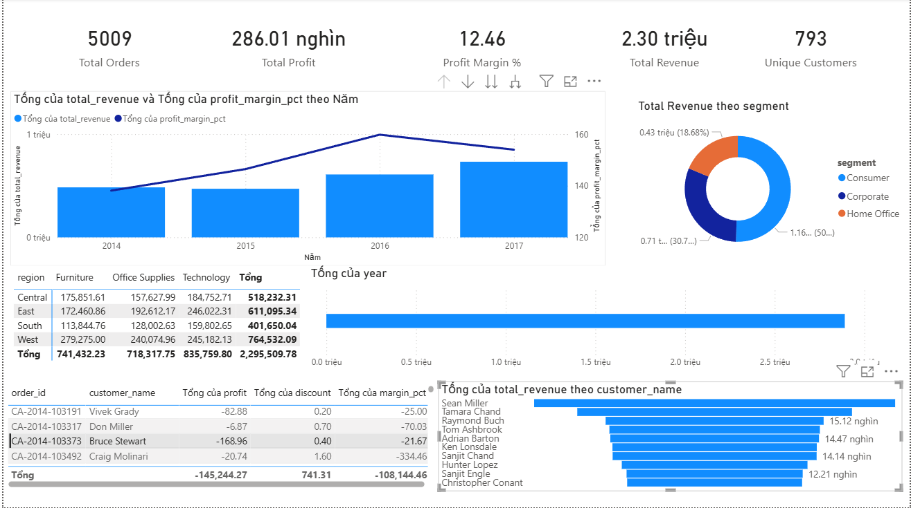
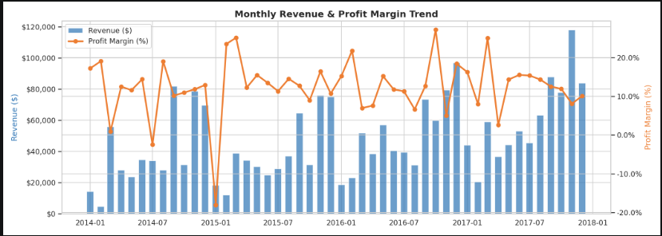
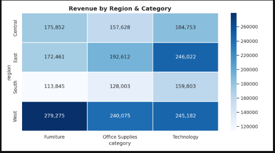
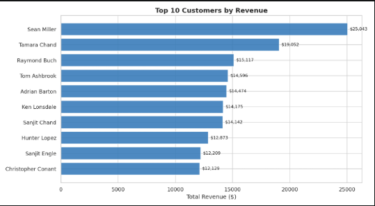
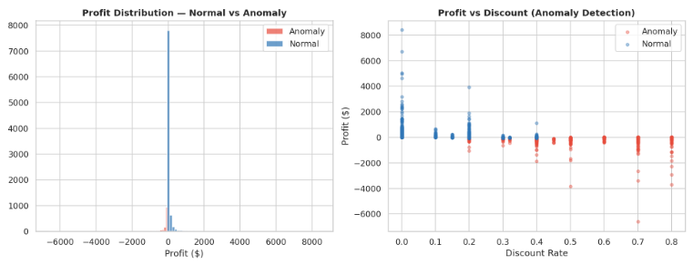

<div align="center">

# 📊 Sales CRM Analytics Pipeline

**End-to-end Data Analytics Project**

[](https://python.org)
[](https://postgresql.org)
[](https://docker.com)
[](https://airflow.apache.org)
[](https://powerbi.microsoft.com)

> Pipeline phân tích dữ liệu CRM bán hàng từ raw CSV đến dashboard tự động —  
> tích hợp Data Quality Check, Star Schema, Airflow Scheduling và Power BI.

</div>

---

## 📌 Tổng quan kiến trúc

```
┌─────────────┐    ┌──────────────────┐    ┌──────────────┐    ┌───────────────┐
│  Raw CSV    │───►│  Data Quality    │───►│  Transform   │───►│  PostgreSQL   │
│ (Superstore)│    │  Check (9 rules) │    │  Star Schema │    │  Star Schema  │
└─────────────┘    └──────────────────┘    └──────────────┘    └───────┬───────┘
                                                                        │
                   ┌──────────────────────────────────────────────────┐ │
                   │              Apache Airflow                       │◄┘
                   │   Schedule: 6:00 AM daily (cron: 0 6 * * *)     │
                   │   extract → quality_check → load → charts        │
                   └──────────────────────────────────────────────────┘
                                                                        │
                   ┌──────────────────┐         ┌──────────────────────┘
                   │   Power BI       │◄────────│   SQL Views (4)      │
                   │   Dashboard      │         │   + EDA Charts (4)   │
                   └──────────────────┘         └──────────────────────┘
```

---

## 🗂 Cấu trúc Project

```
sales-crm-analytics/
│
├── 🐳 docker-compose.yml          # 5 services: PostgreSQL, Jupyter,
│                                  #   pgAdmin, Airflow Webserver, Scheduler
├── 🐳 Dockerfile.jupyter
├── .env                           # Biến môi trường (credentials)
│
├── dags/
│   └── crm_etl_dag.py            # ⭐ Airflow DAG — schedule ETL tự động
│
├── scripts/
│   ├── etl_pipeline.py           # Extract → Quality Check → Transform → Load
│   ├── data_quality.py           # ⭐ 9 Data Quality Rules + log vào DB
│   └── eda_analysis.py           # EDA + 4 biểu đồ PNG
│
├── sql/
│   ├── create_airflow_db.sql     # Tạo DB cho Airflow metadata
│   └── init.sql                  # Star Schema + 4 Views + quality_log table
│
├── data/
│   ├── superstore.csv            # ← Tự tải từ Kaggle (xem Bước 2)
│   └── charts/                   # Output charts sau khi chạy EDA
│
├── notebooks/                    # Jupyter notebooks (tuỳ chọn)
└── powerbi_guide/
    └── CONNECTION_GUIDE.md       # Kết nối Power BI + DAX measures
```



---

## ⭐ Tính năng nổi bật

### 1. Data Quality Check tự động (9 rules)

Mỗi lần ETL chạy, hệ thống tự kiểm tra 9 rules và lưu kết quả vào DB:

| Rule | Mô tả |
|------|-------|
| `null_check_*` | Các cột khoá không được NULL |
| `sales_non_negative` | Sales ≥ 0 |
| `quantity_positive` | Quantity > 0 |
| `discount_range` | Discount trong khoảng [0.0, 1.0] |
| `order_date_not_future` | Ngày đặt hàng không trong tương lai |
| `ship_after_order` | Ship date ≥ Order date |
| `no_duplicate_order_product` | Không trùng cặp (order_id, product_id) |
| `segment_valid_values` | Segment đúng 3 giá trị hợp lệ |
| `discount_extreme_warning` | Cảnh báo discount > 80% |

Xem kết quả trong DB:
```sql
SELECT * FROM data_quality_log ORDER BY run_date DESC;
```

### 2. Apache Airflow Scheduling

DAG `crm_etl_pipeline` chạy tự động mỗi ngày lúc **6:00 sáng**:

```
extract_data → data_quality_check → transform_and_load → generate_charts → pipeline_complete
```

Theo dõi tại: http://localhost:8080

### 3. Star Schema (PostgreSQL)

3 bảng DIM + 1 bảng FACT + 4 SQL Views sẵn dùng cho Power BI.

---

## ⚙️ Yêu cầu hệ thống

| Yêu cầu | Tối thiểu | Khuyến nghị |
|---------|-----------|-------------|
| RAM | 4 GB | 8 GB |
| Disk | 5 GB | 10 GB |
| OS | Windows 10 / macOS 12 / Ubuntu 20.04 | |
| Docker Desktop | v4.0+ | mới nhất |

---

## 🚀 Hướng dẫn chạy từ đầu

### Bước 1 — Cài Docker Desktop

Tải tại: https://www.docker.com/products/docker-desktop

Kiểm tra:
```bash
docker --version          # Docker version 24.x.x
docker compose version    # Docker Compose version v2.x.x
```

> ⚠️ Windows: Bật **WSL 2** khi Docker yêu cầu.

---

### Bước 2 — Tải Dataset từ Kaggle

1. Vào: https://www.kaggle.com/datasets/vivek468/superstore-dataset-final
2. Nhấn **Download**
3. Đổi tên thành `superstore.csv`
4. Đặt vào thư mục `data/`

---

### Bước 3 — Khởi động toàn bộ hệ thống

```bash
git clone https://github.com/<your-username>/sales-crm-analytics.git
cd sales-crm-analytics

# Tạo thư mục Airflow cần thiết
mkdir -p logs plugins

# Khởi động tất cả services
docker compose up -d --build
```

> Lần đầu mất **5–10 phút** để pull images (Airflow ~800MB).

Kiểm tra services:
```bash
docker compose ps
```

Kết quả mong đợi:
```
NAME                  STATUS     PORTS
crm_postgres          running    0.0.0.0:5432->5432/tcp
crm_jupyter           running    0.0.0.0:8888->8888/tcp
crm_pgadmin           running    0.0.0.0:5050->80/tcp
airflow_webserver     running    0.0.0.0:8080->8080/tcp
airflow_scheduler     running
```

---

### Bước 4 — Chạy ETL thủ công (lần đầu)

```bash
docker exec crm_jupyter python work/scripts/etl_pipeline.py
```

Output mong đợi:
```
=======================================================
  Sales CRM Analytics — ETL Pipeline v2
=======================================================
[EXTRACT] Đọc file CSV...
[EXTRACT] ✅ Đọc xong — 9,994 dòng, 21 cột

📋 Bắt đầu Data Quality Checks...
-------------------------------------------------------
  ✅ [PASS] null_check_order_id: Cột 'order_id' không được chứa NULL (0 lỗi)
  ✅ [PASS] sales_non_negative: Sales không được âm (0 lỗi)
  ✅ [PASS] discount_range: Discount phải trong khoảng 0.0 – 1.0 (0 lỗi)
  ...
  Kết quả: 9 PASS | 0 FAIL
  💾 Đã lưu kết quả vào bảng data_quality_log

[TRANSFORM] ✅ Hoàn tất:
  dim_customers : 793 rows
  dim_products  : 1,862 rows
  fact_orders   : 9,994 rows

[LOAD] ✅ Hoàn tất!
✅ Pipeline hoàn tất!
```

---

### Bước 5 — Tạo EDA Charts

```bash
docker exec crm_jupyter python work/scripts/eda_analysis.py
```

Charts lưu vào `data/charts/`:
- `01_monthly_trend.png` — Revenue & Profit Margin theo tháng

- `02_region_category_heatmap.png` — Heatmap Region × Category

- `03_top_customers.png` — Top 10 khách hàng

- `04_anomaly_detection.png` — Phân bố lợi nhuận & Anomaly


---

### Bước 6 — Theo dõi Airflow

Mở: **http://localhost:8080**

Đăng nhập: `admin` / `admin`

Tìm DAG `crm_etl_pipeline` → bật ON → nhấn **Trigger DAG** để chạy thử.

Pipeline sẽ tự động chạy mỗi ngày lúc **6:00 sáng** từ đây trở đi.

---

### Bước 7 — Xem Database qua pgAdmin

Mở: **http://localhost:5050**  
Login: `admin@crm.com` / `admin123`

Thêm server:

| Field | Giá trị |
|-------|---------|
| Host | `postgres` |
| Port | `5432` |
| Database | `crm_db` |
| Username | `analyst` |
| Password | `analyst123` |

---

### Bước 8 — Kết nối Power BI

1. **Home** → **Get Data** → **PostgreSQL database**
2. Server: `localhost` | Database: `crm_db`
3. Username: `analyst` | Password: `analyst123`
4. Import Views: `vw_monthly_kpi`, `vw_top_customers`, `vw_revenue_by_region_category`, `vw_anomaly_orders`

Xem hướng dẫn chi tiết + DAX measures: [`powerbi_guide/CONNECTION_GUIDE.md`](powerbi_guide/CONNECTION_GUIDE.md)

---

## 🗄 Data Model

```
                    ┌──────────────────┐
                    │  dim_customers   │
                    ├──────────────────┤
                    │ customer_id (PK) │
                    │ customer_name    │
                    │ segment          │
                    │ region           │
                    └────────┬─────────┘
                             │
┌──────────────┐    ┌────────▼─────────┐    ┌──────────────────┐
│   dim_date   │    │   fact_orders    │    │   dim_products   │
├──────────────┤    ├──────────────────┤    ├──────────────────┤
│ date_key(PK) ├───►│ order_id    (PK) │◄───┤ product_id  (PK) │
│ year         │    │ order_date  (FK) │    │ product_name     │
│ quarter      │    │ customer_id (FK) │    │ category         │
│ month        │    │ product_id  (FK) │    │ sub_category     │
└──────────────┘    │ sales / profit   │    └──────────────────┘
                    │ quantity/discount│
                    └──────────────────┘
```

---

## 🛑 Quản lý hệ thống

```bash
docker compose stop          # Dừng tạm, giữ data
docker compose start         # Khởi động lại
docker compose down          # Dừng + xoá containers
docker compose down -v       # Reset hoàn toàn (xoá cả data)
docker compose logs -f       # Xem logs realtime
```

---

## 🔧 Xử lý lỗi thường gặp

<details>
<summary><b>❌ Port 5432 already in use</b></summary>

```bash
# macOS
brew services stop postgresql

# Windows
net stop postgresql-x64-15
```
Hoặc đổi port trong `docker-compose.yml` thành `"5433:5432"`
</details>

<details>
<summary><b>❌ FileNotFoundError: superstore.csv</b></summary>

```bash
ls data/   # Kiểm tra file đã đúng tên chưa
# Phải thấy: superstore.csv
```
</details>

<details>
<summary><b>❌ Airflow webserver chưa lên sau 2 phút</b></summary>

```bash
docker compose logs airflow-init    # Xem lỗi init
docker compose restart airflow-webserver
```
</details>

<details>
<summary><b>❌ Power BI không kết nối được PostgreSQL</b></summary>

Cài Npgsql ODBC driver: https://github.com/npgsql/npgsql/releases  
Tải `.msi` → cài → restart Power BI Desktop.
</details>

---

## 📝 Mô tả cho CV / Portfolio

```
PROJECT: Sales CRM Analytics Pipeline
Tech Stack: Python (pandas, numpy, matplotlib, SQLAlchemy),
            PostgreSQL (Star Schema), Apache Airflow,
            Docker Compose, Power BI (DAX)

• Xây dựng ETL pipeline tự động hoá Extract → Transform → Load
  cho 10,000+ transaction records từ nguồn CRM/ERP export (CSV)
• Thiết kế và implement 9 Data Quality Rules với kết quả
  được log tự động vào PostgreSQL sau mỗi lần chạy
• Thiết kế Star Schema (3 DIM + 1 FACT) và 4 SQL Views
  phục vụ trực tiếp Power BI dashboard
• Phát hiện ~245 anomaly orders bằng IQR method
  (discount >40%, profit <−$50)
• Schedule ETL tự động mỗi ngày lúc 6:00 SA bằng Apache Airflow,
  theo dõi qua Airflow UI tại localhost:8080
• Containerize toàn bộ hệ thống (5 services) với Docker Compose —
  môi trường reproducible, khởi động bằng 1 lệnh
```

---

## 📚 Dataset & Tài liệu tham khảo

- Dataset: [Superstore Sales — Kaggle](https://www.kaggle.com/datasets/vivek468/superstore-dataset-final)
- [Apache Airflow Docs](https://airflow.apache.org/docs/)
- [Power BI DAX Reference](https://learn.microsoft.com/en-us/dax/)

---

<div align="center">
Made with ❤️ for Data Analyst Portfolio
</div>
